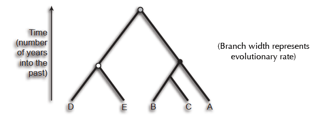
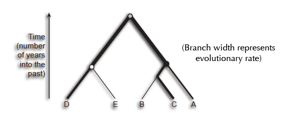
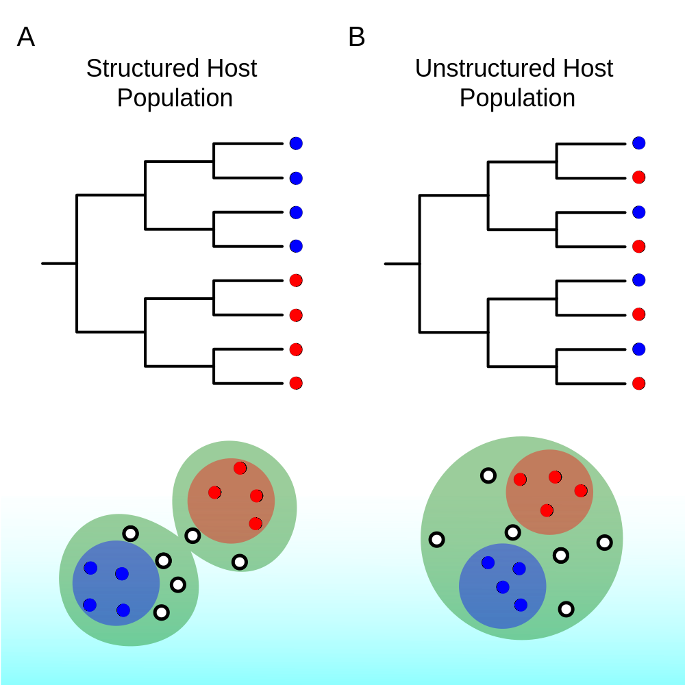

---
title:
output:
  revealjs::revealjs_presentation:
    theme: simple
    css: styles.css
    self_contained: true
    # reveal_plugins: ["zoom","chalkboard"]
always_allow_html: yes
---

```{r setup, include=FALSE}
knitr::opts_chunk$set(echo = FALSE)
knitr::opts_chunk$set(fig.align='center')
knitr::opts_chunk$set(fig.width=7)
knitr::opts_chunk$set(fig.height=5)
knitr::opts_chunk$set(out.extra='border:0px;')
```

## {data-background=#d3d3d3}

<h2 style="color:#0047AB">Phylodynamics in R</h2>
<br>
<h3 style="color:#000000">Simon D.W. Frost</h3>

*University of Cambridge*


<h2>
<span style="font-size:24px"> &nbsp;<a href="mailto:sdwfrost@gmail.com" target="_blank" style="vertical-align:middle">sdwfrost@gmail.com</a></span>
<span style="font-size:24px"> &nbsp;<a href="http://www.twitter.com/sdwfrost" target="_blank" style="vertical-align:middle">@sdwfrost</a></span>
<span style="font-size:24px"> &nbsp;<a href="http://github.com/sdwfrost" target="_blank" style="vertical-align:middle">http://github.com/sdwfrost</a></span>
</h2>

## Introduction

- Overview of some of the tools we use
- More on R packages

## Obtaining sequence data and metadata

- Custom Julia script that flattens INSDSeq XML into tab-separated files and FASTA
- `gbmunge`: a self contained C program that parses GenBank files and generates cleaned metadata (collection date, country code, host) and FASTA files
    - [https://github.com/sdwfrost/gbmunge](https://github.com/sdwfrost/gbmunge)
    - Currently Linux/OSX

## NGS processing

- Trimmomatic + Deconseq + IVA + SMALT
- `popbam`: population analysis of BAM files in R
    - BAM to SNPs
    - Folded binomial analysis of variant frequencies
        - Looking at bottlenecks and within-host evolution of swine 'flu

## Alignment

- Workhorse: MAFFT
- `pipelign`: clusters sequences by length and variation
    - [https://github.com/asmmhossain/pipelign](https://github.com/asmmhossain/pipelign)
- `BioExt`: codon-aware mapping
    - Currently refactoring into a C library

## Genotyping

- `SCUEAL`
- `ANVIL`

## Genetic distances

- `BioExt`
    - Refactored into `libtn93' C library

## Phylogenetic reconstruction

- RAxML
- IQTREE
- HyPhy
    - Ancestral reconstruction

## Selection

- HyPhy
- DataMonkey

## Today

- Our R packages:
    - `treedater`
    - `genieR`
    - `phyland`
    - `treeImbalance`
- Others:
    - `ggtree`
    - `phydynR`

## Time trees

- Phylodynamics approaches typically require a time-calibrated tree
- The idea that sequences evolve at a certain rate i.e. under a molecular clock is a powerful one
- For measurably evolving viruses, it allows us to estimate the evolutionary rate from sequences sampled at different times
    - As long as we have a wide enough sampling interval

## A strict clock

{width="80%"}

## Relaxed clocks

- However, the evolutionary rate may vary across the tree
    - We need a relaxed clock

{width="80%"}

## Fitting relaxed clocks to data

- The programs BEAST and RevBayes can fit relaxed clocks, simultaneously with phylogenetic reconstruction
    - Very computationally intensive
- Initially, we can use a *single* tree e.g. one estimated from maximum likelihood

## treedater

- Fast method for obtaining a time-tree from a phylogeny in terms of distance
- Optimises:
    - The root location (just like root-to-tip)
    - Branch lengths
- See [our paper](https://academic.oup.com/ve/article/4100592) for details

## Inferring population size

{width="60%"}

## Population size in an epidemic

$$
N_e = \frac{I\tau}{2}
$$

- $I$ is the number of infected individuals
- $\tau$ is the generation time (average time between infections)

## Estimating population size over time

- We can recover the 'true' population size if we make an assumption about the recovery/death rate of infected individuals
- We will use the library `skyspline` to do this

## Phylogeography

{width="60%"}

## Inferring migration patterns

- Treat location just like sequence data
    - 'Mugration'
    - Very sensitive to sampling bias
- Structured coalescent models
    - We will use the library `phyland` to fit an island model
        - Population sizes
        - Migration rates between populations

## Confirmatory analyses

- Ideally, we would like to confirm our exploratory results using BEAST
- BEAST2 package, `phydyn`

## Example datasets

- MERS-CoV (camel/human)
- Zaire Ebolavirus (country)
- Lassa fever virus (human/rat)
- RSV (Kilifi/Other)

